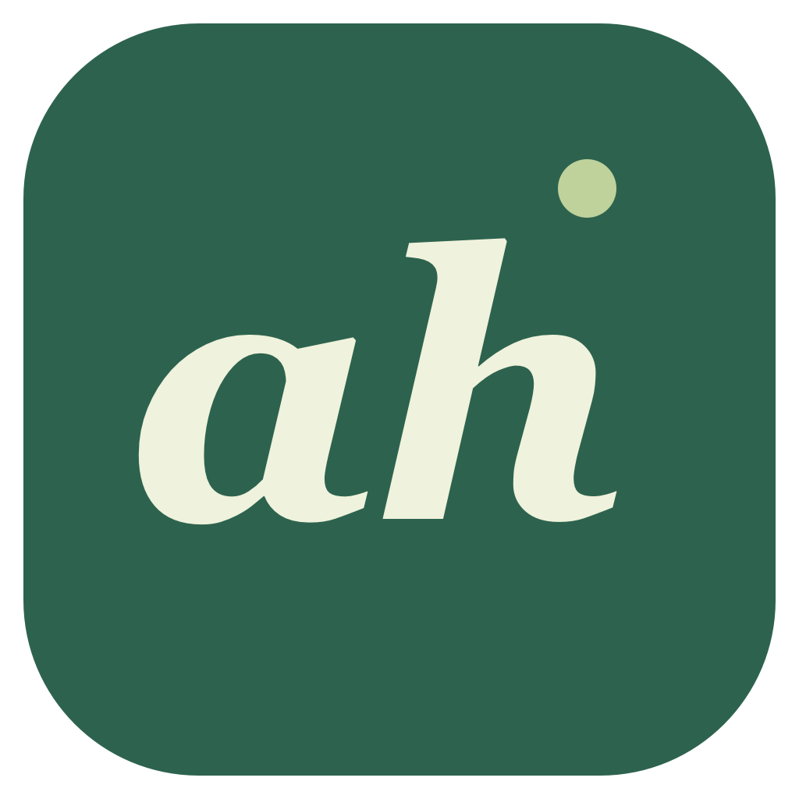

<div align="center">
  
  <h1>Attendance Handler</h1>
  <p><strong>A local-first Windows and macOS classroom companion for iClicker.</strong><br />Keep the real classroom window visible while monitoring runs quietly in the background.</p>
  <p>
    <a href="https://github.com/tzuo5/attendance-handler/releases/download/v0.1.1/Attendance-Handler-0.1.1-mac-universal.dmg"><strong>Download for macOS</strong></a>
    ·
    <a href="https://github.com/tzuo5/attendance-handler/releases/download/v0.1.1/Attendance-Handler-0.1.1-win-x64-Setup.exe"><strong>Download for Windows</strong></a>
    ·
    <a href="https://github.com/tzuo5/attendance-handler/releases">All releases</a>
    ·
    <a href="README.zh-CN.md">中文说明</a>
  </p>
</div>

<p align="center">
  <a href="https://github.com/tzuo5/attendance-handler/actions/workflows/ci.yml"></a>
  <a href="https://github.com/tzuo5/attendance-handler/releases/latest"></a>
  
  
</p>

> **Preview release** — This project is designed for personal, local use. The simulated classroom flow is tested; final verification against a live iClicker class is still pending. Use it only where your course policy permits.

## Development plan

See the [phased development plan (中文)](dev-plans.md) for the MVP roadmap, dependencies, and acceptance checkpoints: classroom feedback and logs, first-run setup, background mode, scheduled starts, and calendar integration ideas. These are planned improvements; completed checkpoints and verification evidence are tracked in that document.

Scheduled starts are being built in separate checkpoints. The [schedule rules (中文)](docs/scheduled-starts.md) define time zones, DST, late starts, conflicts, and tray runtime requirements; P4.2 now supports creating, editing, pausing, cancelling, and saving single/weekly plans with upcoming start/end previews. P4.3 now starts monitoring automatically while the App remains in the tray, saves an execution claim before opening the classroom, and prevents repeat starts after restart. Late starts keep the original end; monitoring, attendance and answer receipts are reported separately. P4.4 adds resume checks, clock-change handling, interrupted-claim feedback and batched missed weekly records. The schedule page shows dated outcomes; exiting the App or sleeping the computer prevents execution, and the App does not wake the computer. Physical sleep and real-classroom acceptance remain pending.

Calendar interaction remains an ideation proposal. Read the [@tt scenarios and semantics (中文)](docs/calendar-ideation.md), [Google / Apple access research (中文)](docs/calendar-provider-research.md), [event-to-schedule mapping (中文)](docs/calendar-mapping.md), and [synthetic event examples](docs/examples/calendar-intents.json). The proposed first path uses Google read-only scopes and local polling; Apple EventKit requires full calendar access even for an App that only reads events. The mapping proposes UTC single-occurrence plans and a separate durable calendar-instance claim; those product changes are not implemented. The App has not connected to either provider.

The [offline calendar prototype](docs/examples/calendar-prototype.html) opens as one local HTML file with six guided scenarios and free-play buttons. It uses synthetic events and memory only, and never starts a classroom. The [feasibility decision and next checkpoints (中文)](docs/calendar-decision.md) record what was verified and the separate authorization, storage, and platform work required before product integration.

The current source branch includes Phase 1: clearer monitoring and recovery states, question receipts, a full event log, a ten-minute session extension, saved end summaries, and simpler course configuration. All four Phase 2 MVPs are implemented: environment checks, a resumable first-run wizard, page-verified sign-in with course import, and explicit reminder confirmation with a readiness summary. P3.2 adds a saved background-mode preference and monitoring without a visible Chrome window. Human walkthrough and platform limits are recorded in verification. The download links above still point to the earlier `v0.1.1` release.

## What it does

Attendance Handler turns a repetitive classroom setup into one visible, supervised session:

| | Capability | What to expect |
| --- | --- | --- |
| ◉ | **Visible Chrome** | A dedicated Chrome profile stays open and usable. Monitoring continues when the window is covered or minimized. |
| ✓ | **Attendance** | Applies the saved location, opens the course, joins when available, and waits for a confirmed attendance state. |
| A | **Automatic A** | For eligible open single-choice polls, selects A once and waits for the website receipt. Existing answers are never overwritten. |
| ♧ | **Answer reminders** | For accuracy-sensitive courses or unsupported question types, sends a notification immediately and repeats every 30 seconds until the question is resolved. |
| ⏱ | **Session watchdog** | Checks every 5 seconds, uses the configured duration as a hard deadline, backs off during network failures, and keeps the computer awake without preventing the display from sleeping. |
| ↻ | **Recovery and feedback** | Shows reconnecting, expired login, and a closed classroom distinctly. Questions show pending attempts and confirmed receipts; extend only the current session by ten minutes. |
| ≡ | **Classroom records** | Search and filter up to 2,000 local events, including question titles and timestamps. Review the last 100 end summaries and their associated logs. |
| + | **Course setup** | Import the name and link, paste a coordinate pair, reuse a named classroom, and choose a common duration and answer mode. |
| ◎ | **Local-first storage** | Courses stay on your computer. Login session storage is encrypted with Electron `safeStorage`; passwords are never stored. |

## First-run setup (current source)

New users follow environment checks, sign-in, course import and configuration, a reminder test, and completion. Progress and saved courses survive interruptions. Reopen the wizard from connection settings; existing course users start on their courses. Complete school verification in visible Chrome; a verified page continues to course import, with empty accounts and read failures reported separately. Confirm seeing the test notification or defer and revisit it. Completion rechecks environment and sign-in and can start your first class.

## Background mode (current source)

In connection settings choose **Background mode** for your next session. The default keeps the classroom window visible. Changes apply to the next class; App and tray show the actual current mode and monitoring state. Headless Chrome uses the same dedicated profile and encrypted login. Closing the App window keeps monitoring in the tray. **View classroom** opens an operable window while retaining the original deadline and answer records. **Return to background** rechecks the current course and website receipts before closing the window. Pending answers, unfinished sign-in, unknown pages, dialogs, or additional tabs keep the window open with repair guidance; the current session, original deadline, and handled answers remain in place. Background Chrome reconnects up to three times after an unexpected exit. After an App interruption, **Resume previous classroom** retains the original deadline and answer records; expired sessions stay ended. Quitting cleans up the dedicated browser. See [implementation and verification](docs/background-mode.md).

## The classroom flow

```text
Configure a course
        ↓
Start session → dedicated Chrome + location override
        ↓
Wait for class / confirm attendance
        ↓
Poll the existing page every 5 seconds
        ├─ eligible single-choice → select A → verify receipt
        └─ manual-answer mode     → notify → user clicks to return
        ↓
Deadline or “End class” → stop checks, reminders, and location override
```

Automatic actions run through the page and CDP connection. They do not simulate system mouse or keyboard input and do not activate the frontmost app. Only an explicit **Log in**, **View classroom**, or notification click brings the dedicated Chrome window forward.

Closing the last dedicated Chrome window ends that browser process. You can reopen it with **Log in** or **View classroom**. Quitting Attendance Handler also closes its dedicated Chrome; closing only the App window keeps monitoring in the menu bar or system tray.

## Download and install

### Windows 10/11 (64-bit)

1. Download the [Windows installer](https://github.com/tzuo5/attendance-handler/releases/download/v0.1.1/Attendance-Handler-0.1.1-win-x64-Setup.exe) and install for your Windows user.
2. Install Google Chrome, then launch **Attendance Handler** from the Start menu. Node.js is not required.
3. Sign in using the dedicated Chrome window and configure your course. Closing the app window keeps monitoring in the system tray; double-click the tray icon to reopen it.

A [ZIP version](https://github.com/tzuo5/attendance-handler/releases/download/v0.1.1/Attendance-Handler-0.1.1-win-x64.zip) is also available: extract the entire folder and run `Attendance Handler.exe`. Use the installer for Start menu registration and Windows notifications. [Windows SHA-256 checksums](https://github.com/tzuo5/attendance-handler/releases/download/v0.1.1/SHA256SUMS-windows.txt) are included. The Windows build is unsigned, so Windows may show an unknown-publisher or SmartScreen prompt.

### macOS

1. Download the [universal DMG](https://github.com/tzuo5/attendance-handler/releases/download/v0.1.1/Attendance-Handler-0.1.1-mac-universal.dmg). It runs on macOS 13+ with Apple Silicon or Intel.
2. Open it and drag **Attendance Handler** into **Applications**.
3. Launch it from Applications. Google Chrome must already be installed in `/Applications`; Node.js is not required.
4. Complete iClicker sign-in and any school verification in the dedicated Chrome window, then import or configure a course.

The release also includes a [ZIP fallback](https://github.com/tzuo5/attendance-handler/releases/download/v0.1.1/Attendance-Handler-0.1.1-mac-universal.zip) and [SHA-256 checksums](https://github.com/tzuo5/attendance-handler/releases/download/v0.1.1/SHA256SUMS.txt).

### Gatekeeper notice

`v0.1.1` is ad-hoc signed and not notarized with Apple. macOS may require a one-time manual approval in **System Settings → Privacy & Security** after you confirm that the download came from this release. Do not disable macOS security globally, and do not bypass a damaged-app or malware warning. A future Developer ID + notarized build can remove this first-launch warning.

## Build from source

Requirements: Node.js 22.12+ and Google Chrome. On macOS, install Apple Command Line Tools and Chrome in `/Applications`. On Windows x64, the build uses the .NET Framework C# compiler included with Windows; install Chrome for your user or all users.

```sh
npm install
npm run dev                 # local app development
npm test                    # unit tests
npm run test:renderer       # synthetic UI, including the smallest app window
npm run test:chrome-lifecycle # dedicated Chrome close and reopen checks
npm run test:integration    # isolated mock Chrome classroom
npm run audit:public        # public-data allowlist and secret scan
npm run dist:mac            # on macOS: universal DMG + ZIP in release-public/
npm run dist:win            # on Windows: x64 installer + ZIP in release-public/
```

`npm run demo` starts a completely local classroom simulator. It never contacts real iClicker and uses synthetic course data and coordinates. The integration suite uses a temporary Chrome profile and never touches a daily Chrome session.

## Privacy boundary

The public repository and release artifacts do not contain personal courses, real course IDs, coordinates, credentials, tokens, browser profiles, run logs, or personal screenshots. The app stores user-entered course coordinates locally because the classroom site needs them; the course list displays a saved classroom name or **Location configured**, with coordinates visible only in the editor.

Read the full [privacy and release boundary](PRIVACY.md) before sharing diagnostics. The public-data audit is part of the build workflow, but you should still review any file before attaching it to an issue.

## Project layout

```text
src/main/browser.ts        dedicated Chrome, CDP, geolocation, encrypted session
src/main/iclicker.ts       page snapshots, passive evidence, safe answer actions
src/main/watchdog.ts       5-second checks, deadlines, retries, reminders
src/renderer/              React + TypeScript desktop UI
scripts/mock-classroom.mjs local classroom simulator
tests/                     unit coverage for watchdog and page evidence
```

See [verification notes](VERIFICATION.md) and the [v0.1.1 release notes](docs/RELEASE-v0.1.1.md) for tested behavior and known limits.

## License and status

This repository is an early preview and does not currently declare an open-source license. All rights remain with the author. Contributions and bug reports are welcome, but please never include login tokens, course coordinates, screenshots with personal data, or raw browser profiles.

<div align="center">
  <sub>Built for a calmer classroom workflow · Windows + macOS · Electron · React · TypeScript</sub>
</div>
