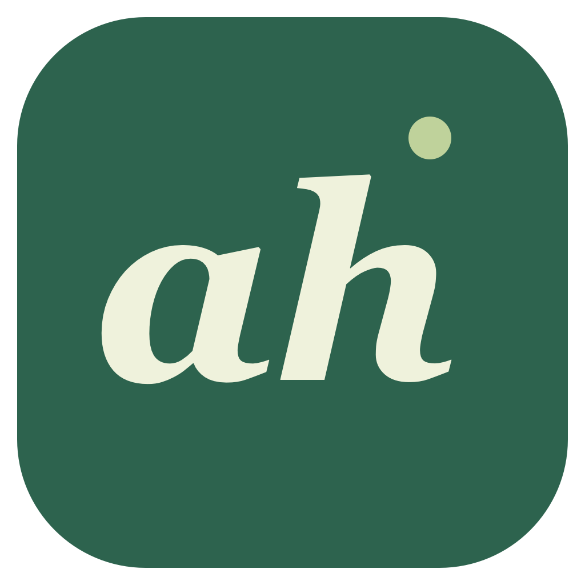

<div align="center">
  
  <h1>Attendance Handler</h1>
  <p><strong>面向 iClicker 的本地优先 Windows / macOS 课堂助手。</strong><br />保留真实课堂窗口可见，同时在后台安静地监控签到和题目。</p>
  <p>
    <a href="https://github.com/tzuo5/attendance-handler/releases/download/v0.1.0/Attendance-Handler-0.1.0-mac-universal.dmg"><strong>下载 macOS 版本</strong></a>
    ·
    <a href="https://github.com/tzuo5/attendance-handler/releases/download/v0.1.0/Attendance-Handler-0.1.0-win-x64-Setup.exe"><strong>下载 Windows 版本</strong></a>
    ·
    <a href="https://github.com/tzuo5/attendance-handler/releases">全部 Release</a>
    ·
    <a href="README.md">English</a>
  </p>
</div>

<p align="center">
  <a href="https://github.com/tzuo5/attendance-handler/actions/workflows/ci.yml"></a>
  <a href="https://github.com/tzuo5/attendance-handler/releases/latest"></a>
  
  
</p>

> **预览版本** — 本项目面向个人、本机使用。模拟课堂流程已经测试，真实 iClicker 课堂的最终联调仍待完成。请只在课程规则允许的情况下使用。

## 功能概览

| | 功能 | 行为 |
| --- | --- | --- |
| ◉ | **可见 Chrome** | 使用独立 Chrome 资料目录，窗口可操作；被遮挡或最小化后仍继续监控。 |
| ✓ | **签到** | 应用保存的位置，打开课程，在老师开课后加入，并等待网站确认签到状态。 |
| A | **自动选择 A** | 对符合条件的开放单选题只选择一次 A，并等待网站回执；不会覆盖已有答案。 |
| ♧ | **答题提醒** | 对需要准确率的课程或不支持的题型立即提醒，题目仍未完成时每 30 秒重复提醒。 |
| ⏱ | **课堂 watchdog** | 每 5 秒检查，以课程时长作为硬截止时间；网络异常时退避重试，防止闲置睡眠但允许屏幕熄灭。 |
| ◎ | **本地优先** | 课程保存在本机；登录会话使用 Electron `safeStorage` 加密，App 不保存密码。 |

## 课堂流程

```text
配置课程
    ↓
开始上课 → 打开独立 Chrome + 应用位置覆盖
    ↓
等待开课 / 确认签到
    ↓
每 5 秒检查当前页面
    ├─ 合格单选题 → 选择 A → 确认回执
    └─ 手动作答模式 → 发通知 → 点击返回课堂
    ↓
到时或“结束上课” → 停止检查、提醒和位置覆盖
```

自动操作通过页面和 CDP 连接完成，不模拟系统鼠标键盘，也不会切换当前正在使用的 App。只有用户点击 **登录**、**查看课堂** 或系统通知时，才会把专用 Chrome 带到前台。

## 下载与安装

### Windows 10/11（64 位）

1. 下载 [Windows 安装包](https://github.com/tzuo5/attendance-handler/releases/download/v0.1.0/Attendance-Handler-0.1.0-win-x64-Setup.exe)，为当前用户安装。
2. 安装 Google Chrome，从开始菜单启动 **Attendance Handler**，不需要 Node.js。
3. 在专用 Chrome 窗口登录并配置课程。关闭 App 窗口后会继续在系统托盘运行；双击托盘图标即可重新打开。

也可下载 [免安装 ZIP](https://github.com/tzuo5/attendance-handler/releases/download/v0.1.0/Attendance-Handler-0.1.0-win-x64.zip)，完整解压后运行 `Attendance Handler.exe`。建议使用安装包，以完成开始菜单和 Windows 通知注册。附带 [Windows SHA-256 校验值](https://github.com/tzuo5/attendance-handler/releases/download/v0.1.0/SHA256SUMS-windows.txt)。Windows 版本尚未代码签名，首次运行可能显示“未知发布者”或 SmartScreen 提示。

### macOS

1. 下载 [通用 DMG](https://github.com/tzuo5/attendance-handler/releases/download/v0.1.0/Attendance-Handler-0.1.0-mac-universal.dmg)，支持 macOS 13+、Apple Silicon 和 Intel。
2. 打开 DMG，把 **Attendance Handler** 拖到 **Applications**。
3. 从 Applications 启动。需要预先把 Google Chrome 安装在 `/Applications`，不需要 Node.js。
4. 在专用 Chrome 窗口完成 iClicker 登录和学校验证，然后导入或配置课程。

Release 还提供 [ZIP 备用包](https://github.com/tzuo5/attendance-handler/releases/download/v0.1.0/Attendance-Handler-0.1.0-mac-universal.zip) 和 [SHA-256 校验值](https://github.com/tzuo5/attendance-handler/releases/download/v0.1.0/SHA256SUMS.txt)。

### macOS 安全提示

`v0.1.0` 使用 ad-hoc 签名，尚未经过 Apple 公证。确认下载来自本 Release 后，macOS 首次打开可能需要在 **系统设置 → 隐私与安全性** 手动允许。不要全局关闭 macOS 安全保护，也不要强行绕过“App 已损坏”或恶意软件警告。未来配置 Developer ID 和 Apple 公证后，可以去掉首次启动提示。

## 从源码构建

需要 Node.js 22.12+ 和 Google Chrome。macOS 还需要 Apple Command Line Tools，并将 Chrome 安装在 `/Applications`。Windows x64 使用系统自带的 .NET Framework C# 编译器，支持查找当前用户或所有用户安装的 Chrome。

```sh
npm install
npm run dev                 # 本地开发
npm test                    # 单元测试
npm run test:integration    # 独立模拟 Chrome 课堂
npm run audit:public        # 公开数据白名单与敏感信息扫描
npm run dist:mac            # macOS：在 release-public/ 生成通用 DMG + ZIP
npm run dist:win            # Windows：在 release-public/ 生成 x64 安装包 + ZIP
```

`npm run demo` 会启动完全本地的模拟课堂，不连接真实 iClicker，并使用合成课程数据和坐标。集成测试使用临时 Chrome 资料目录，不会操作日常 Chrome 会话。

## 隐私边界

公开仓库和 Release 附件不包含个人课程、真实课程标识、经纬度、账号、密码、令牌、浏览器资料、运行日志或个人截图。App 会把用户输入的课程坐标保存在本机，因为课堂网页需要它；课程列表默认只显示“位置已设置”，不直接展示坐标。

发布前请阅读完整的[隐私与发布边界](PRIVACY.md)。自动扫描是保护措施之一，创建 Issue 或上传诊断文件前仍应逐项检查。

## 项目结构

```text
src/main/browser.ts          专用 Chrome、CDP、定位、加密会话
src/main/iclicker.ts         页面快照、被动证据、安全答题操作
src/main/watchdog.ts         5 秒检查、截止时间、重试、提醒
src/renderer/                React + TypeScript 桌面界面
scripts/mock-classroom.mjs   本地模拟课堂
tests/                       watchdog 和页面证据测试
```

更多已验证行为和限制见[验证记录](VERIFICATION.md)及 [v0.1.0 Release 说明](docs/RELEASE-v0.1.0.zh-CN.md)。

## 许可证与状态

这是早期预览版本，目前没有声明开源许可证，版权归作者所有。欢迎提交 Issue，但请不要包含登录令牌、课程坐标、含个人信息的截图或原始浏览器资料。
